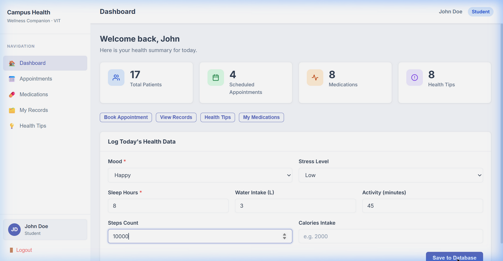
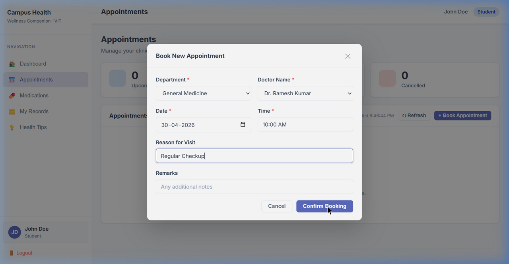

# PROJECT REPORT

## 1. Front Page

**Project Title:** Campus Health and Wellness Companion  
**Team Member Name:** Dittya D  
**Register Number:** 24BCE5045  

---

## 2. Project Abstract
The Campus Health and Wellness Companion is a comprehensive web-based platform designed to monitor, track, and manage the health and wellness of university students. The application streamlines healthcare access by bridging the gap between students and campus healthcare providers. It provides features like booking medical appointments, viewing diagnostic test results, tracking ongoing medications, and managing personal medical history. Additionally, the system includes wellness tracking to monitor daily habits such as sleep, hydration, and mood, coupled with personalized health tips. Built with a modern full-stack architecture, the application leverages React.js for an intuitive user interface, Flask for a scalable API backend, and an Oracle 21c Database for robust and secure data storage. The solution efficiently digitizes clinical processes, eliminating redundant paperwork.

## 3. Tools and Technologies Used
* **Frontend Development:** React.js, React Router, Ant Design (UI Framework), HTML5, CSS3
* **Backend Development:** Python, Flask, Flask-CORS
* **Database Management:** Oracle Database 21c XE
* **Database Connector/Driver:** `oracledb` (Python DB API)
* **Environment & Tools:** Node.js, npm, Axios components

## 4. Introduction
The health and wellness of students plays a vital role in their academic performance and overall well-being. Despite this, accessing campus health resources can often be cumbersome. The Campus Health and Wellness Companion aims to digitize and simplify these interactions. This platform centralizes scattered medical records into an organized system where students can proactively manage their health metrics and connect with doctors via seamless appointment scheduling. The project demonstrates the successful implementation of Database Management System (DBMS) principles, securely executing and handling complex relational queries to retrieve, update, and manage patient data across multiple entities (Patients, Appointments, Medications, and Billing).

## 5. Modules of the Project
1. **Authentication Module:** Secure login and registration for students. Implements SHA-256 for password hashing and validation.
2. **Dashboard & Wellness Tracker:** A centralized hub providing visual insights into daily wellness parameters (e.g., sleep duration, water intake, screen time) for proactive health monitoring.
3. **Appointment Scheduling:** Empowers users to seamlessly book consultations with on-campus doctors, specifying departments and timeslots. Includes status monitoring for scheduled visits.
4. **Health Records & Diagnostics Management:** Houses complete medical histories, including chronic conditions, allergies, past surgeries, and lab diagnostic test outcomes.
5. **Medications Management:** Enables users to track active prescriptions, dosage frequencies, and duration, ensuring medical adherence.
6. **Administrator Portal:** Dedicated administrative suite for healthcare providers to view and oversee global patient records.
7. **Health Tips Feed:** A dynamic, searchable repository of preventative health practices and articles.

## 6. Sample Code
### Database Connection and API Route (Backend - Python/Flask)
```python
def get_db_connection():
    """Create and return a new Oracle DB connection."""
    connection = oracledb.connect(
        user="system", password="your_password", dsn="localhost:1521/XE"
    )
    return connection

@app.route("/api/appointments", methods=["POST"])
def add_appointment():
    data = request.get_json()
    try:
        conn = get_db_connection()
        cursor = conn.cursor()
        cursor.execute("""
            INSERT INTO APPOINTMENT_24BCE5045 (
                appointment_id, patient_id, doctor_name, department,
                appointment_date, appointment_time, appointment_status, reason_for_visit
            ) VALUES (
                SEQ_APPOINTMENT_24BCE5045.NEXTVAL, :patient_id, :doctor_name, :department,
                TO_DATE(:appt_date, 'YYYY-MM-DD'), :appt_time, 'Scheduled', :reason
            )
        """, {
            "patient_id": data.get("patient_id"),
            "doctor_name": data.get("doctor_name"),
            "department": data.get("department"),
            "appt_date": data.get("appointment_date"),
            "appt_time": data.get("appointment_time"),
            "reason": data.get("reason_for_visit")
        })
        conn.commit()
        cursor.close(); conn.close()
        return jsonify({"success": True, "message": "Appointment booked"}), 201
    except Exception as e:
        return jsonify({"success": False, "error": str(e)}), 500
```

### React API Integration (Frontend - JavaScript)
```javascript
const fetchAppointments = async () => {
  try {
    const response = await fetch(`http://localhost:5000/api/appointments/patient/${userId}`);
    const result = await response.json();
    if (result.success) {
      setAppointments(result.data);
    }
  } catch (error) {
    console.error("Failed to load appointments", error);
  }
};
```

## 7. Sample Screen Shots

1. **Dashboard Home:**
   

2. **Booking an Appointment:**
   

## 8. Conclusion
The Campus Health and Wellness Companion provides a robust, scalable, and user-friendly digital solution to manage campus healthcare effectively. By integrating a secure Oracle backend via Python Flask with a responsive React frontend, the system guarantees efficient record-keeping, swift data retrieval, and easy access to medical services. This project successfully incorporates core DBMS concepts like advanced structured querying, primary-foreign key relationships, constraints, sequence generation, and database normalization, ultimately proving the importance of robust database systems in the healthcare domain.

## 9. Google Drive Link and Demo Video

* **Google Drive Project Link:** *(Zip file uploaded to your Drive)*
* **Demo Video Link (2 Minutes):** [Click to View Full Video Demo](./demo_video.webp)
